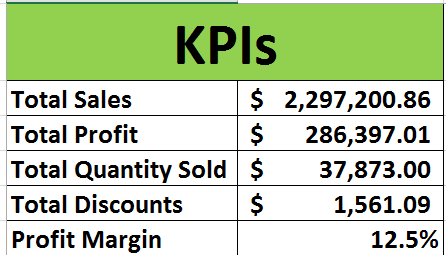
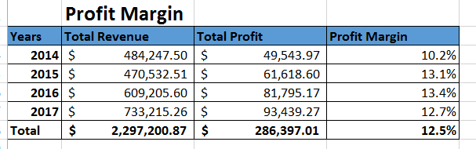
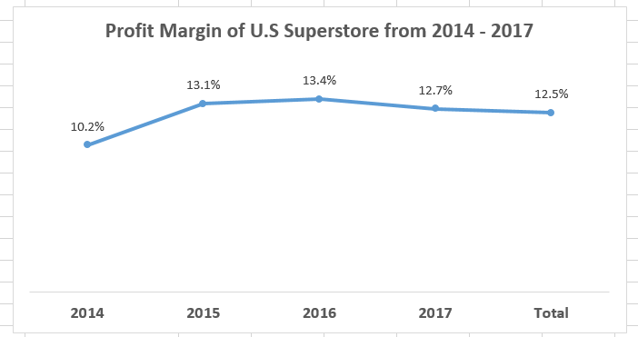
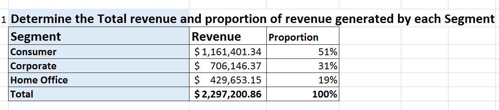
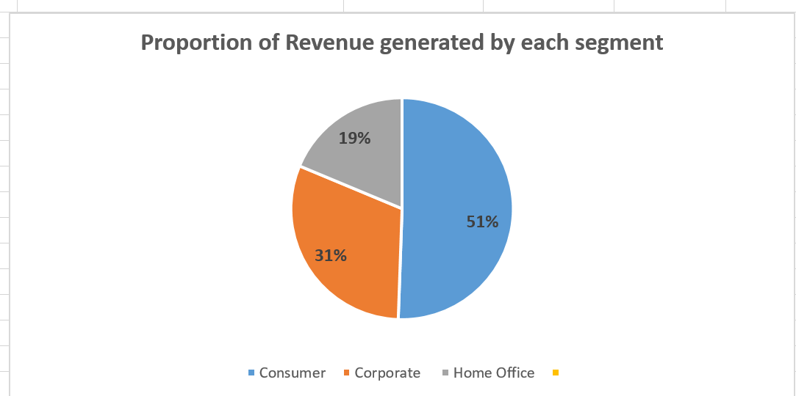

# Data-Analysis-on-the-Sales-of-U.S-Superstore
### Introduction
The U.S superstore is a company which deals with the sales of different categories of product ranging from consumer goods,Corporate and Home office. This dataset was given to us by our instructor and i checked for Duplicates and missing data but found it clean.

### Problem Statement
1. Determine the total revenue and proportion of revenue contributed by each segment.						
2. What is the total profit by year?						
3. Determine which category of product made the  highest  and least  profit and in which city and state. 						
4. Determine the proportion of sales and profit contributed by each Region						
5. What were the sales of 2016 and 2017 by Months?						
6. Determine the top ten customers and their contribution to the total revenue and quantity of goods bought

### KPIs

We came up with four KPIs which will be used in this project

## Data Analysis and Visualization
### Profit Margin
Pivot table               |            Visualisation
:------------------------:|:------------------------:
    | 

From the above analysis, the least profit margin of U.S Superstore was generated in 2014. However, in 2015, there was a remarkable increase by 2.9% i.e it increases from 10.2% in 2014 to 13.1% in 2015 indicating progress in the U.S Superstore. The highest profit margin was experienced in 2016 meaning 13.4%  of the total Revenue for that year made up the company's profit. Comparing the profit margin between 2015 and 2016, only 0.3% revenue for 2016 made up the company's profit. It also implies that, if strategies are not put in place to curb this situation, the company may likely be stagnant in the nearest future and if possible start regressing which is the case of 2017. In 2017, only 12.7% of the Store's total revenue contributed to it's profit indicating 0.7%  decrease from 2016 -2017.Averagely, the store had as it profit margin 12.5% for the past four years which isn't bad but needs to improve. As a recommendation, U.S superstore should cut all unnecessary expenditures by reducing overhead (Overhead refers to the ongoing costs to operate a business but excludes the direct costs associated with creating a product or service) and production costs. There should also be  an insignificant increase in the pricing of the company's product so that consumers won't feel the impact. 

### Total Revenue and proportion of revenue contributed by each segment
Table                     |           Visualisation
:-------------------------|:------------------------:
         |
The consumer segment contributed a revenue of $1.161,401.34 that is 51% to it's total sales while Corporate and Home Office contributed 31% and 19% respectively.

### Total Profit by Year
Table                     |            Visualisation
:-------------------------|:-------------------------:
  |
